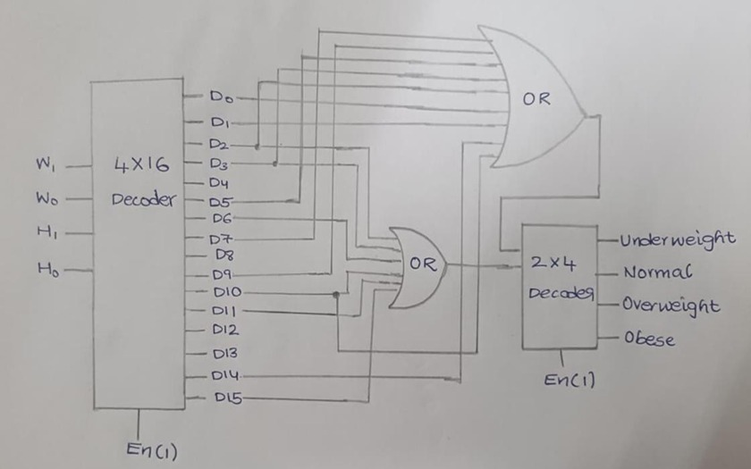
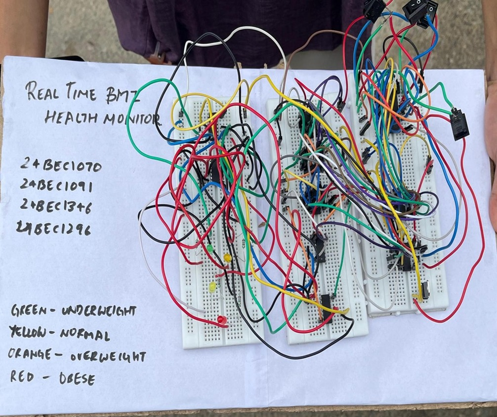

# Real-Time BMI Monitoring System

A Digital Logic Design project that implements a **real-time Body Mass Index (BMI) classification system** using combinational circuits and decoder-based logic.

This project demonstrates how digital electronics can be used to classify BMI categories based on encoded height and weight inputs.

---

## Project Overview

Body Mass Index (BMI) is widely used to assess whether a person has a healthy body weight.

This project implements a **hardware-based BMI classification system** using digital logic components. The system encodes height and weight ranges as binary inputs and processes them using decoders and logic gates to determine the BMI category.

The output is displayed using LED indicators representing different BMI classes.

---

## BMI Categories

| Binary Code | BMI Category |
|-------------|--------------|
| 00 | Underweight |
| 01 | Normal |
| 10 | Overweight |
| 11 | Obese |

---

## System Architecture

1. Height and weight are encoded using **2-bit inputs**.
2. A **4-to-16 Decoder (IC 74154)** generates unique outputs for each combination.
3. **OR gate networks (IC 7432)** generate the BMI classification code.
4. A **2-to-4 Decoder (IC 74139)** activates the corresponding LED indicator.

This combinational logic design enables **instant real-time BMI classification**.

---

## Components Used

- 4-to-16 Decoder (IC 74154)
- 2-to-4 Decoder (IC 74139)
- NOT Gate (IC 7404)
- OR Gate (IC 7432)
- LEDs
- Resistors (220Ω, 330Ω)
- Breadboard
- DIP Switches
- Power Supply (5V)

These components together implement the BMI classification logic. :contentReference[oaicite:0]{index=0}

---

## Circuit Diagram

---

## Hardware Implementation

---

## Verilog Implementation

The project was implemented and verified using **three different Verilog modeling styles**:

- Behavioral Modeling
- Dataflow Modeling
- Structural Modeling

A **testbench** was also created to simulate all possible input combinations.

All source codes are available in the **code folder**.

---

## Documentation

📄 **Project Report**  
[Click here to view the report](docs/BMI_Project_Report.pdf)

---

📊 **Presentation Slides**  
[Click here to view the presentation](docs/BMI_Project_Presentation.pptx)

